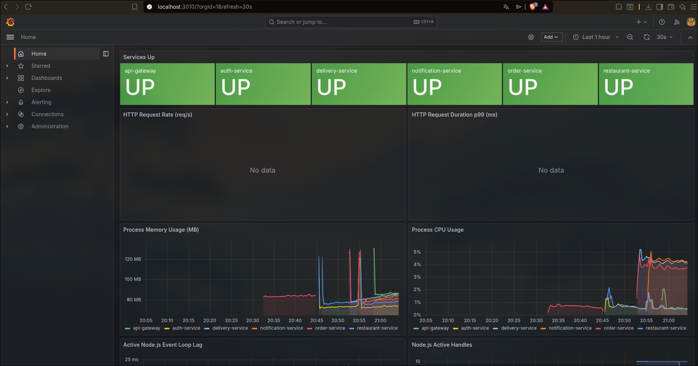

# Food Delivery Platform — Cloud-Native Microservices

> Production-grade food delivery platform inspired by Uber Eats. Built with a distributed microservices architecture, event-driven communication, real-time GraphQL subscriptions, and full observability.



---

## Architecture Overview

```
┌─────────────────────────────────────────────────────────────┐
│                    CLIENT (React — WIP)                      │
└──────────────────────────┬──────────────────────────────────┘
                           │ GraphQL / WebSocket
┌──────────────────────────▼──────────────────────────────────┐
│           API GATEWAY — Apollo Federation v2                 │
│      JWT auth · Redis rate limiting · WS subscriptions      │
└──┬──────────┬────────────┬──────────────────────────────────┘
   │          │            │
   ▼          ▼            ▼
┌──────┐ ┌──────────┐ ┌──────────┐
│ AUTH │ │RESTAURANT│ │  ORDER   │
│ JWT  │ │  + Redis │ │  + Kafka │
│ RBAC │ │   Cache  │ │  Events  │
└──────┘ └──────────┘ └────┬─────┘
                           │ Kafka Events
              ┌────────────┴───────────┐
              ▼                        ▼
        ┌──────────┐           ┌──────────────┐
        │ DELIVERY │           │ NOTIFICATION │
        │ GeoHash  │           │ Email + SMS  │
        │  Assign  │           │   Mock       │
        └──────────┘           └──────────────┘

┌─────────────────────────────────────────────────────────────┐
│                    OBSERVABILITY                             │
│         Prometheus (metrics) · Grafana (dashboards)         │
└─────────────────────────────────────────────────────────────┘
```

### Event Flow

```
order.created  →  delivery-service assigns rider  →  delivery.assigned
                                                  →  notification-service notifies user
order.delivered →  notification-service notifies customer
order.cancelled →  delivery-service frees driver  →  notification-service notifies
```

---

## Tech Stack

| Layer | Technology |
|-------|------------|
| **API Layer** | Apollo Federation v2, GraphQL, WebSocket subscriptions |
| **Backend** | Node.js + TypeScript, Express, Apollo Server |
| **Databases** | PostgreSQL (one per service), Redis (cache + pub/sub) |
| **Event Streaming** | Apache Kafka (KRaft), 13 topics + 3 DLQs |
| **Containers** | Docker + Docker Compose |
| **Orchestration** | Kubernetes + Helm charts |
| **Infrastructure** | Terraform (AWS EKS, RDS, MSK, ElastiCache) |
| **Observability** | Prometheus + Grafana |
| **CI/CD** | GitHub Actions (6 workflows) |
| **Auth** | JWT (access + refresh), Redis token blacklist, bcrypt |

---

## Services

| Service | Port | Description |
|---------|------|-------------|
| **api-gateway** | 4000 | Apollo Federation gateway — federates 3 subgraphs, JWT validation, Redis rate limiting, WebSocket proxy |
| **auth-service** | 3002 | Register/login/logout/refresh, bcrypt, JWT, Redis blacklist, rate limiting 5req/15min |
| **restaurant-service** | 3001 | Restaurant + menu CRUD, Redis cache-aside, Kafka producer, owner RBAC |
| **order-service** | 3000 | Order lifecycle, price validation vs restaurant-service, Redis pub/sub subscriptions, Kafka producer |
| **delivery-service** | 3003 | Kafka consumer, auto-assigns drivers, geolocation mock, Kafka producer |
| **notification-service** | 3004 | 5 Kafka consumers, mock email + SMS providers, real-time push via GraphQL subscriptions |

---

## Key Engineering Decisions

**Kafka retry + DLQ** — All consumers implement exponential backoff (3 retries, 1s base, ×2) with dead-letter queues on exhaustion. No event is silently dropped.

**Kafka idempotency** — order-service tracks processed event IDs in Redis (SET NX, 24h TTL) to prevent duplicate processing under consumer restarts.

**Price validation** — order-service calls restaurant-service via HTTP before creating an order. Fails hard if restaurant-service is down — no stale prices accepted.

**Owner authorization** — restaurant-service mutations verify `ownerId` from JWT matches the restaurant record. ADMIN role bypasses for ops.

**Redis pub/sub subscriptions** — GraphQL subscriptions use Redis pub/sub (not in-memory), enabling horizontal scaling across multiple service instances.

**Federation** — api-gateway uses Apollo Federation v2 `IntrospectAndCompose`. Each service implements `buildSubgraphSchema` with `@key` directives.

---

## Running Locally

### Prerequisites
- Docker + Docker Compose
- Node.js 20+

### Start everything

```bash
git clone https://github.com/brixxdd/Proyeceto-personal.git
cd Proyeceto-personal

# Start all infrastructure + services
docker-compose up -d

# Seed demo data (5 users, 3 restaurants, 12 menu items)
node scripts/seed.js
```

### Access points

| Service | URL |
|---------|-----|
| GraphQL Playground | http://localhost:4000/graphql |
| Grafana (admin/admin) | http://localhost:3010 |
| Prometheus | http://localhost:9090 |
| Adminer (DB browser) | http://localhost:8080 |

### Run tests

```bash
# All services
for s in auth-service restaurant-service order-service delivery-service notification-service api-gateway; do
  echo "=== $s ===" && cd services/$s && npm test && cd ../..
done

# Single service with coverage
cd services/order-service && npm run test:coverage
```

---

## Test Coverage

| Service | Tests | Coverage |
|---------|-------|----------|
| auth-service | 37 | ~90% |
| restaurant-service | 61 | ~90% |
| order-service | 45 | ~85% |
| delivery-service | 48 | ~80% |
| notification-service | 33 | ~80% |
| api-gateway | 22 | 100% (auth middleware) |
| **Total** | **246** | |

---

## Observability

All services expose `/metrics` (Prometheus format). Grafana has two pre-built dashboards:

- **Overview** — service health, HTTP request rate, p99 latency, CPU + memory per service
- **Business Metrics** — orders created, delivery assignments, active deliveries, available drivers, cache hit rate, Kafka throughput

---

## Infrastructure (Terraform)

Full AWS infrastructure in `infrastructure/terraform/`:

- **VPC** — multi-AZ, public + private subnets
- **EKS** — managed Kubernetes cluster
- **RDS** — PostgreSQL instances (one per service)
- **MSK** — managed Kafka cluster
- **ElastiCache** — managed Redis

---

## Helm Charts

One chart per service in `helm-charts/<service>/`. Each chart includes:

`Deployment` · `Service` · `HPA` · `Secret` · `ConfigMap` · `ServiceAccount` · `ServiceMonitor`

---

## CI/CD

GitHub Actions workflows for all 6 services:

```
lint → test (with coverage) → build Docker image → push to GHCR → deploy via ArgoCD
```

Workflows in `.github/workflows/`.

---

## Project Status

| Phase | Status |
|-------|--------|
| Core Services (6/6) | ✅ Complete |
| Kafka + Events + DLQ | ✅ Complete |
| Helm Charts (6/6) | ✅ Complete |
| CI/CD Workflows | ✅ Complete |
| Tests (246 passing) | ✅ Complete |
| Observability (Prometheus + Grafana) | ✅ Complete |
| ArgoCD + GitOps | 🚧 In Progress |
| Frontend (React) | 📋 Pending |

---

## Demo Credentials

```
Admin:              admin@fooddelivery.com   / (see seed script)
Restaurant Owner:   owner1@test.com
Customer:           customer1@test.com
```

---

*Cloud-native portfolio project targeting mid/senior backend engineering roles. Demonstrates distributed systems, event-driven architecture, and production observability patterns.*
