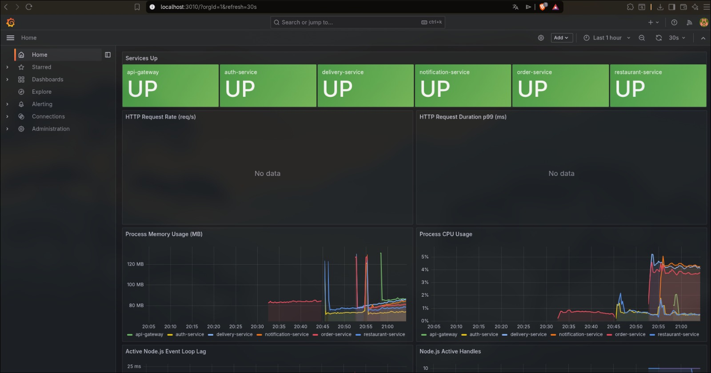

<div align="center">

# Food Delivery Platform

**Production-grade distributed food delivery system**

*Microservices · Event-Driven · Real-Time · Observable*

[](https://nodejs.org)
[](https://typescriptlang.org)
[](https://graphql.org)
[](https://kafka.apache.org)
[](https://kubernetes.io)
[](.)
[](LICENSE)

</div>

---

## Overview

Cloud-native food delivery platform inspired by Uber Eats. Built to demonstrate **production-level backend engineering** — not a CRUD app. Every architectural decision reflects real-world distributed systems challenges: service isolation, async event processing, fault tolerance, and observability at scale.

> **Portfolio target:** Mid/Senior Backend Engineer · Distributed Systems · Platform Engineering

---

## Live Observability

> 6 services instrumented with Prometheus. Real-time Grafana dashboards auto-provisioned on startup.



*All 6 microservices reporting metrics — memory, CPU, event loop lag, request rates*

---

## Architecture

```
                        ┌─────────────────┐
                        │  React Frontend  │  ← In Progress
                        └────────┬────────┘
                                 │ GraphQL · WebSocket
                ┌────────────────▼──────────────────┐
                │      API GATEWAY  :4000            │
                │  Apollo Federation v2              │
                │  JWT validation · Redis rate limit │
                │  WebSocket subscription proxy      │
                └──────┬──────────┬────────┬────────┘
                       │          │        │
               ┌───────▼──┐ ┌────▼────┐ ┌─▼──────┐
               │   AUTH   │ │RESTAURANT│ │ ORDER  │
               │  :3002   │ │  :3001  │ │ :3000  │
               │ JWT+Redis│ │Redis    │ │ Redis  │
               │ bcrypt   │ │Cache    │ │ PubSub │
               └──────────┘ └─────────┘ └───┬────┘
                                             │
                               ┌─────────────▼──────────────┐
                               │       Apache Kafka          │
                               │  13 topics · 3 DLQs        │
                               │  Retry + exponential backoff│
                               └──────────┬─────────────────┘
                                          │
                          ┌───────────────┴──────────────┐
                          │                              │
                  ┌───────▼──────┐             ┌─────────▼──────┐
                  │   DELIVERY   │             │  NOTIFICATION  │
                  │    :3003     │             │     :3004      │
                  │ Auto-assign  │             │ Email · SMS    │
                  │ GeoHash mock │             │ Push (WS)      │
                  └──────────────┘             └────────────────┘

┌──────────────────────────────────────────────────────────────┐
│                     OBSERVABILITY                            │
│          Prometheus :9090  ·  Grafana :3010                  │
│        Metrics · Dashboards · Service health tracking        │
└──────────────────────────────────────────────────────────────┘
```

### Event Flow

```
Customer places order
  → order.created  ──→  delivery-service  (assigns nearest available driver)
                    ──→  notification-service  (notifies customer: "Order confirmed")
                              ↓
                    delivery.assigned  ──→  notification-service  (notifies driver)
                              ↓
                    order.delivered    ──→  notification-service  (notifies customer)
```

---

## Services

| Service | Port | Responsibility | Key Tech |
|---------|------|----------------|----------|
| **api-gateway** | 4000 | Federation gateway, JWT auth, rate limiting, WS proxy | Apollo Federation v2, Redis |
| **auth-service** | 3002 | Register · Login · Logout · Refresh token · RBAC | JWT, bcrypt, Redis blacklist |
| **restaurant-service** | 3001 | Restaurant + menu CRUD, owner authorization | Redis cache-aside, Kafka producer |
| **order-service** | 3000 | Order lifecycle, price validation, real-time status | Redis pub/sub, Kafka producer |
| **delivery-service** | 3003 | Auto-assign drivers, track deliveries | Kafka consumer, PostgreSQL |
| **notification-service** | 3004 | Multi-channel notifications (email, SMS, push) | 5 Kafka consumers, WebSocket |

---

## Tech Stack

| Layer | Technology |
|-------|------------|
| **API** | GraphQL, Apollo Federation v2, WebSocket subscriptions |
| **Runtime** | Node.js 20, TypeScript 5.3, Express |
| **Databases** | PostgreSQL 15 (isolated per service), Redis 7 |
| **Messaging** | Apache Kafka (Confluent 7.5), 13 topics, 3 DLQs |
| **Auth** | JWT (access + refresh tokens), bcrypt salt 12, Redis blacklist |
| **Containers** | Docker, Docker Compose |
| **Kubernetes** | Helm charts (6 services), HPA, ServiceMonitor |
| **Infrastructure** | Terraform — AWS EKS, RDS, MSK, ElastiCache |
| **Observability** | Prometheus, Grafana (2 dashboards, auto-provisioned) |
| **CI/CD** | GitHub Actions (6 workflows) |
| **Migrations** | node-pg-migrate |
| **Testing** | Jest, ts-jest, 246 tests |

---

## Engineering Highlights

### Fault Tolerance
- **Exponential backoff + DLQ** — All Kafka consumers retry 3× (1s, 2s, 4s) before publishing to dead-letter queue. Zero silent failures.
- **Idempotent event processing** — Redis SET NX (24h TTL) prevents duplicate order processing under consumer restarts.
- **Hard price validation** — order-service calls restaurant-service via HTTP before creating any order. No fallback — stale prices are rejected.

### Real-Time
- **GraphQL subscriptions** backed by Redis pub/sub — scales horizontally across service replicas.
- **WebSocket proxy** in api-gateway forwards subscription traffic to order-service without terminating the connection.

### Security
- **JWT + refresh token rotation** with Redis blacklist for instant logout invalidation.
- **Rate limiting** — 5 login attempts per IP+email per 15 minutes.
- **Owner authorization** — restaurant mutations verify JWT `userId` matches restaurant `ownerId`. ADMIN bypass for ops.

### Observability
- Every service exposes `/metrics` (prom-client). Prometheus scrapes at 10s intervals. Grafana dashboards load automatically on first boot via provisioning.

---

## Quick Start

```bash
# Clone
git clone https://github.com/brixxdd/Proyeceto-personal.git
cd Proyeceto-personal

# Start full stack (services + infra)
docker-compose up -d

# Seed demo data
node scripts/seed.js
```

### Access

| | URL | Credentials |
|-|-----|-------------|
| GraphQL Playground | http://localhost:4000/graphql | — |
| Grafana | http://localhost:3010 | admin / admin |
| Prometheus | http://localhost:9090 | — |
| DB Browser (Adminer) | http://localhost:8080 | postgres / postgres |

### Per-service dev

```bash
cd services/order-service
npm run dev          # hot reload
npm test             # jest
npm run test:coverage
npm run migrate:up
```

---

## Tests

```bash
# Run all services
for s in auth-service restaurant-service order-service delivery-service notification-service api-gateway; do
  echo "=== $s ===" && cd services/$s && npm test && cd ../..
done
```

| Service | Tests | Notes |
|---------|-------|-------|
| auth-service | 37 | Unit + integration (resolvers, JWT, bcrypt) |
| restaurant-service | 61 | Unit + integration (CRUD, cache, owner auth) |
| order-service | 45 | Unit (service, repository, middleware, Kafka client) |
| delivery-service | 48 | Unit (service, repository, Kafka consumer) |
| notification-service | 33 | Unit (service, 5 Kafka consumers, email/SMS mock) |
| api-gateway | 22 | Unit (JWT middleware, health, federation) |
| **Total** | **246** | All mocked — no real DB/Redis/Kafka needed in CI |

---

## Infrastructure

```
infrastructure/terraform/
├── modules/
│   ├── vpc/          # Multi-AZ VPC, public + private subnets
│   ├── eks/          # Managed Kubernetes cluster
│   ├── rds/          # PostgreSQL (one instance per service)
│   ├── msk/          # Managed Kafka cluster
│   └── elasticache/  # Managed Redis
```

```
helm-charts/
├── api-gateway/
├── auth-service/
├── delivery-service/
├── notification-service/
├── order-service/
└── restaurant-service/
```

Each chart includes: `Deployment · Service · HPA · Secret · ConfigMap · ServiceAccount · ServiceMonitor`

---

## Project Status

| Phase | Progress | Status |
|-------|----------|--------|
| Core services (6/6) | 100% | ✅ |
| Kafka + Events + DLQ + Retry | 100% | ✅ |
| Helm charts (6/6) | 100% | ✅ |
| CI/CD — GitHub Actions (6/6) | 100% | ✅ |
| Tests — 246 passing | 100% | ✅ |
| Observability — Prometheus + Grafana | 100% | ✅ |
| ArgoCD + GitOps | 0% | 🚧 |
| Frontend — React | 0% | 📋 |

**Overall: ~80% complete**

---

## Demo Users

| Role | Email |
|------|-------|
| Admin | admin@fooddelivery.com |
| Restaurant Owner | owner1@test.com · owner2@test.com |
| Customer | customer1@test.com · customer2@test.com |

Passwords in `scripts/seed.js`.

---

<div align="center">

*Built as a portfolio project to demonstrate production-grade distributed systems architecture.*
*Targeting mid/senior backend engineering roles.*

</div>
