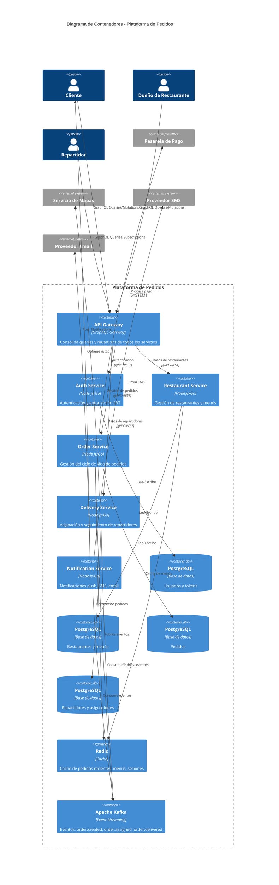

# Diagrama de Contenedores C4

## Descripción

El diagrama de contenedores muestra los microservicios principales y cómo interactúan entre sí.

## Diagrama Mermaid

## Descripción de Contenedores

### API Gateway
- Punto de entrada único para todas las peticiones GraphQL
- Consolida schemas de todos los microservicios
- Maneja autenticación y rate limiting

### Microservicios

1. **Auth Service**: Gestiona autenticación, autorización y tokens JWT
2. **Restaurant Service**: CRUD de restaurantes, menús y productos
3. **Order Service**: Ciclo de vida completo de pedidos (creación, asignación, entrega)
4. **Delivery Service**: Gestión de repartidores y asignación de pedidos
5. **Notification Service**: Envía notificaciones a través de múltiples canales

### Almacenamiento

- **PostgreSQL**: Una base de datos por microservicio (patrón Database per Service)
- **Redis**: Cache distribuido para mejorar latencia
- **Kafka**: Event streaming para comunicación asíncrona entre servicios

## Patrones de Comunicación

- **Síncrona**: API Gateway → Microservicios (gRPC/REST)
- **Asíncrona**: Eventos Kafka entre microservicios
- **Tiempo Real**: GraphQL Subscriptions para actualizaciones en vivo

