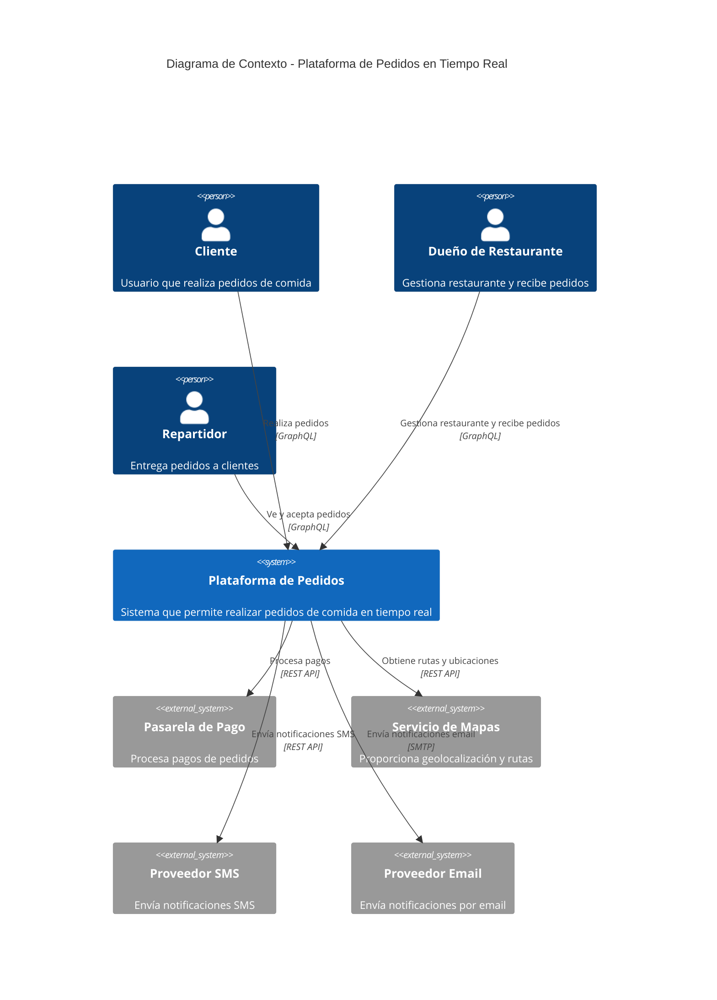

# Diagrama de Contexto C4

## Descripción

El diagrama de contexto muestra el sistema de pedidos en tiempo real y sus interacciones con usuarios externos y sistemas externos.

## Diagrama Mermaid

## Descripción de Actores

### Usuarios

- **Cliente**: Usuario final que realiza pedidos de comida a través de la aplicación móvil o web.
- **Dueño de Restaurante**: Gestiona su restaurante, actualiza menús y recibe notificaciones de nuevos pedidos.
- **Repartidor**: Ve pedidos disponibles y acepta entregas.

### Sistemas Externos

- **Pasarela de Pago**: Procesa transacciones de pago de forma segura.
- **Servicio de Mapas**: Proporciona geolocalización, cálculo de rutas y estimaciones de tiempo.
- **Proveedor SMS**: Envía notificaciones SMS a usuarios.
- **Proveedor Email**: Envía notificaciones por correo electrónico.

## Flujos Principales

1. **Cliente realiza pedido**: El cliente selecciona productos, realiza el pedido a través de GraphQL, y el sistema procesa el pago.
2. **Restaurante recibe pedido**: El restaurante recibe una notificación en tiempo real del nuevo pedido.
3. **Asignación de repartidor**: Los repartidores disponibles ven el pedido y pueden aceptarlo.
4. **Seguimiento en tiempo real**: Todos los actores pueden seguir el estado del pedido en tiempo real.

