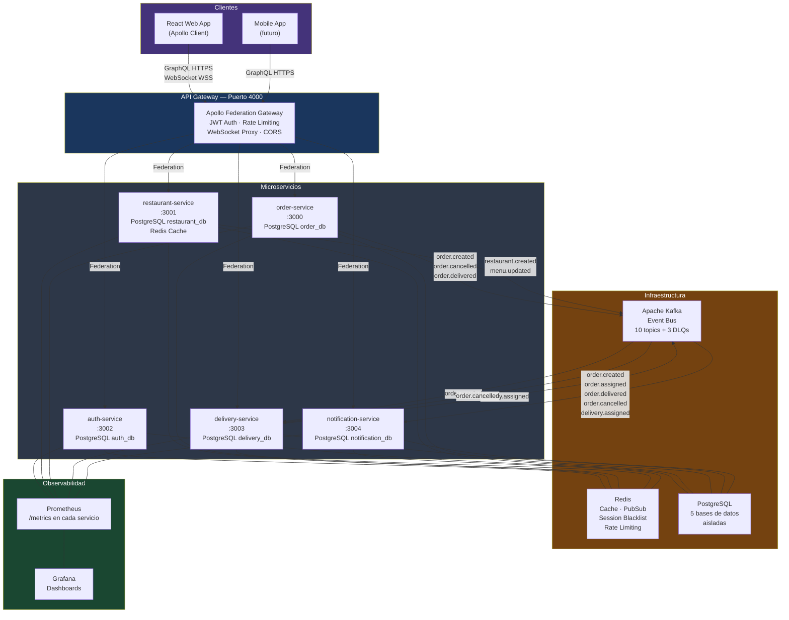
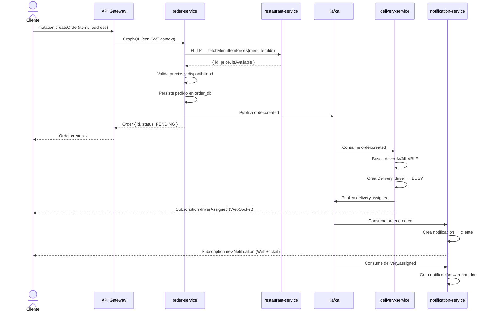
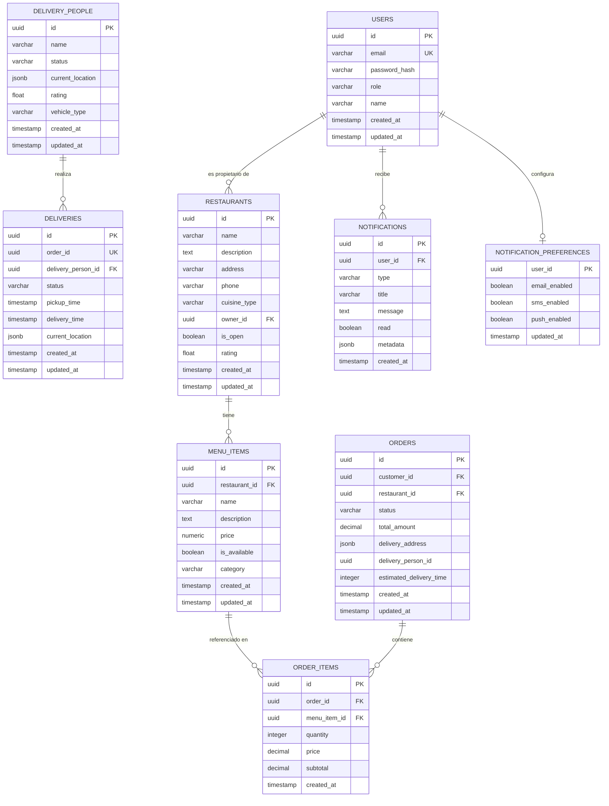

# Plataforma de Pedidos en Tiempo Real
## Entregable 1 — Definición del Problema y Diseño de Arquitectura

**Fecha:** Abril 2026  
**Alumno:** brixxdd  
**Período:** 08 – 13 Abril 2026

---

## 1. Definición del Problema

### 1.1 Contexto

El comercio de alimentos a domicilio en ciudades intermedias de México —como Tapachula, Chiapas— carece de plataformas digitales locales que ofrezcan seguimiento en tiempo real, integración con negocios locales y una experiencia comparable a Uber Eats o Rappi. Los restaurantes dependen de llamadas telefónicas y mensajería informal, generando demoras, pedidos perdidos y clientes insatisfechos.

### 1.2 Problema Central

**¿Cómo construir una plataforma de pedidos distribuida, escalable y en tiempo real que conecte clientes, restaurantes y repartidores de forma confiable?**

Problemas específicos que se resuelven:

| Problema | Impacto |
|----------|---------|
| Sin seguimiento en tiempo real del pedido | Clientes sin visibilidad generan llamadas de soporte |
| Gestión manual de menús y disponibilidad | Pedidos de items agotados, cancelaciones frecuentes |
| Sin asignación automática de repartidores | Demoras, pedidos sin atender |
| Sin notificaciones automáticas | Restaurantes y repartidores desinformados |
| Sistemas monolíticos frágiles | Un fallo tumba toda la operación |

### 1.3 Solución Propuesta

Una **plataforma cloud-native distribuida** basada en microservicios con:
- API GraphQL federada como punto único de acceso
- Eventos asíncronos vía Apache Kafka para desacoplar servicios
- Seguimiento en tiempo real con WebSocket + GraphQL Subscriptions
- Observabilidad completa (métricas, logs, trazas)

---

## 2. Requerimientos del Sistema

### 2.1 Requerimientos Funcionales

#### RF-01 Autenticación y Autorización
- RF-01.1: Registro de usuario con email y contraseña (bcrypt, salt 12)
- RF-01.2: Login con JWT (access token 1h + refresh token 7d)
- RF-01.3: Logout con blacklist Redis
- RF-01.4: RBAC: roles CUSTOMER, RESTAURANT_OWNER, DELIVERY_PERSON, ADMIN
- RF-01.5: Rate limiting: máx. 5 intentos de login por IP/15 min

#### RF-02 Gestión de Restaurantes
- RF-02.1: CRUD de restaurantes (solo el propietario puede modificar el suyo)
- RF-02.2: CRUD de ítems del menú con precio y disponibilidad
- RF-02.3: Cache de menús populares en Redis (TTL configurable)
- RF-02.4: Búsqueda por tipo de cocina y estado (abierto/cerrado)

#### RF-03 Gestión de Pedidos
- RF-03.1: Crear pedido — valida precios con restaurant-service en tiempo real
- RF-03.2: Ciclo de vida: PENDING → CONFIRMED → PREPARING → READY → ASSIGNED → PICKED_UP → IN_TRANSIT → DELIVERED
- RF-03.3: Cancelación de pedido
- RF-03.4: Seguimiento en tiempo real vía GraphQL Subscription

#### RF-04 Gestión de Entregas
- RF-04.1: Asignación automática de repartidor disponible al recibir evento `order.created`
- RF-04.2: Actualización de estado de entrega y ubicación del repartidor
- RF-04.3: Liberación de repartidor al cancelar pedido

#### RF-05 Notificaciones
- RF-05.1: Notificación al cliente al crear pedido, asignar repartidor, entregar y cancelar
- RF-05.2: Notificación al repartidor al ser asignado a un pedido
- RF-05.3: Historial de notificaciones por usuario
- RF-05.4: Preferencias de notificación (email, SMS, push)

### 2.2 Requerimientos No Funcionales

| ID | Requerimiento | Métrica |
|----|--------------|---------|
| RNF-01 | Disponibilidad | 99.9% uptime (< 8.7 h/año downtime) |
| RNF-02 | Latencia | P95 < 200ms en operaciones de lectura |
| RNF-03 | Escalabilidad | Horizontal vía Kubernetes HPA |
| RNF-04 | Seguridad | JWT firmado, bcrypt, rate limiting, secrets en K8s Secrets |
| RNF-05 | Observabilidad | Métricas Prometheus, logs estructurados JSON, trazas distribuidas |
| RNF-06 | Resiliencia | Graceful degradation si Kafka no disponible; circuit breaker por servicio |
| RNF-07 | Idempotencia | Eventos Kafka con deduplicación vía Redis (event ID tracking) |

---

## 3. Arquitectura Propuesta

### 3.1 Estilo Arquitectónico

**Microservicios con Event-Driven Architecture (EDA)**

- Cada servicio tiene su propia base de datos (Database per Service pattern)
- Comunicación sincrónica vía GraphQL (Federation v2)
- Comunicación asincrónica vía Apache Kafka
- API Gateway como único punto de entrada externo

### 3.2 Diagrama de Arquitectura

### 3.3 Flujo de un Pedido (Secuencia de Eventos)

### 3.4 Componentes del Sistema

| Componente | Responsabilidad | Puerto |
|-----------|----------------|--------|
| **api-gateway** | Punto único de entrada, JWT, rate limiting, WS proxy | 4000 |
| **auth-service** | Registro, login, JWT, blacklist, refresh tokens | 3002 |
| **restaurant-service** | CRUD restaurantes y menús, cache Redis | 3001 |
| **order-service** | Ciclo de vida de pedidos, subscriptions, Kafka producer | 3000 |
| **delivery-service** | Asignación de repartidores, Kafka consumer | 3003 |
| **notification-service** | Notificaciones multi-canal, Kafka consumer | 3004 |

---

## 4. Tecnologías a Utilizar

### 4.1 Stack Tecnológico

| Capa | Tecnología | Justificación |
|------|-----------|---------------|
| **Frontend** | React 18 + TypeScript + Apollo Client | Componentes reactivos, GraphQL integrado nativamente |
| **API** | GraphQL (Apollo Federation v2) | API unificada, cada servicio expone su subgraph |
| **Backend** | Node.js 20 + TypeScript (strict) | Tipado fuerte, ecosistema maduro para microservicios |
| **Base de datos** | PostgreSQL 15 | ACID, JSONB para datos semiestructurados, UUID |
| **Cache** | Redis 7 | Cache aside, PubSub para subscriptions, blacklist JWT |
| **Mensajería** | Apache Kafka 3.5 | Alta throughput, durabilidad de eventos, consumer groups |
| **Contenedores** | Docker + Kubernetes (EKS) | Orquestación, auto-scaling, rolling deployments |
| **Infraestructura** | Terraform (AWS: EKS, RDS, MSK, ElastiCache) | IaC reproducible |
| **Observabilidad** | Prometheus + Grafana + Winston | Métricas, alertas, logs estructurados JSON |
| **CI/CD** | GitHub Actions + ArgoCD | Pipeline automatizado, GitOps |
| **Helm** | Helm 3 | Templates K8s parametrizables por servicio |

### 4.2 Patrones Arquitectónicos

- **Database per Service** — aislamiento total de datos entre servicios
- **Event Sourcing parcial** — estado del pedido reconstruible desde eventos Kafka
- **Cache-Aside** — Redis como capa de caché en restaurant-service y order-service
- **Saga (coreografía)** — transacciones distribuidas vía eventos (sin coordinador central)
- **Idempotent Consumer** — deduplicación de eventos con Redis SET NX
- **Dead Letter Queue** — eventos fallidos a topics `.dlq` para reproceso manual

---

## 5. Modelo de Datos

### 5.1 Diagrama Entidad-Relación

### 5.2 Descripción de Bases de Datos

| Base de Datos | Servicio | Tablas Principales |
|--------------|---------|-------------------|
| `auth_db` | auth-service | `users` |
| `restaurant_db` | restaurant-service | `restaurants`, `menu_items` |
| `order_db` | order-service | `orders`, `order_items` |
| `delivery_db` | delivery-service | `delivery_people`, `deliveries` |
| `notification_db` | notification-service | `notifications`, `notification_preferences` |

### 5.3 Decisiones de Diseño del Modelo

- **UUID como PK** — evita colisiones en entornos distribuidos, no expone secuencias
- **JSONB para datos semiestructurados** — `delivery_address`, `current_location`, `metadata` son flexibles por naturaleza
- **Bases de datos aisladas** — ningún servicio accede a la BD de otro; comunicación solo vía API o eventos
- **`order_id` UNIQUE en `deliveries`** — un pedido tiene exactamente una entrega activa
- **`pgmigrations` por BD** — cada servicio gestiona sus propias migraciones con node-pg-migrate

---

## 6. Conclusiones

La plataforma propuesta resuelve el problema de gestión de pedidos en tiempo real mediante:

1. **Desacoplamiento total** entre servicios vía Kafka — si el delivery-service falla, los pedidos siguen creándose
2. **Escalabilidad horizontal** — cada microservicio escala independientemente según su carga (HPA en K8s)
3. **Tiempo real nativo** — GraphQL Subscriptions sobre WebSocket en todos los servicios con estado dinámico
4. **Resiliencia** — DLQs para eventos fallidos, graceful shutdown, rate limiting, token blacklist
5. **Portafolio diferenciador** — arquitectura de nivel Mid/Senior que demuestra dominio de sistemas distribuidos en producción

---

*Documento generado como parte del proyecto académico de la plataforma de pedidos en tiempo real.*
